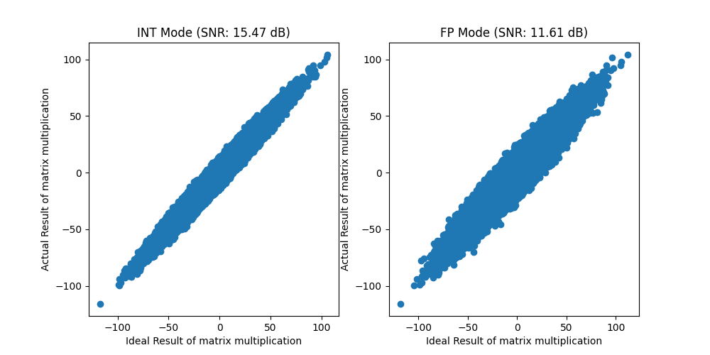

# Memintelli---Memristive Intelligient Computing Simulator: Examples
We have many different examples to explore the many features of Memristive Intelligient Computing Simulator.
## Example 1: [`01_matrix_multiplication.py`](./01_matrix_multiplication.py)
In this example, a simple matrix multiplication is demonstrated by Memintelli. It specifies the memristive device parameter of `DPETensor` as follows:

```python
mem_engine = DPETensor(
        HGS=1e-5,                       # High conductance state
        LGS=1e-8,                       # Low conductance state
        var=0.05,                       # Random Gaussian noise of conductance
        rdac=2**2,                      # Number of DAC resolution 
        g_level=2**2,                   # Number of conductance levels
        radc=2**10,                     # Number of ADC resolution 
        weight_quant_gran=(128, 128),   # Quantization granularity of the weight matrix
        input_quant_gran=(1, 128),      # Quantization granularity of the input matrix
        weight_paral_size=(32, 32),     # The size of the crossbar array used for parallel computation, 
                                        # where (32, 32) here indicates that the weight matrix is divided into 32x32 sub-arrays for parallel computation
        input_paral_size=(1, 32)        # The size of the input data used for parallel computation,
                                        # where (1, 32) here indicates that the input matrix is divided into 1×32 sub-inputs for parallel computation
    )
```
And the dynamic bit-slicing method is used for inputs and weights, which can combine the accuracy of SLC (single-level cell) and the efficiency of MlC (multi-level cell), and the details can be viewed on the paper: [Shao-Qin Tong et al. (2024) Energy-Efficient Brain Floating Point Convolutional Neural Network Using Memristors. IEEE TED](https://ieeexplore.ieee.org/abstract/document/10486875).
```python
# Define dynamic bit-slicing parameters for input and weight. Inputs and weights both use 8-bits, where the higher two bits use two SLCs and the remaining bits consist of 3 MLCs
input_slice = torch.tensor([1, 1, 2, 2, 2]) 
weight_slice = torch.tensor([1, 1, 2, 2, 2])
```
Here we use both INT quantization and FP quantization modes, of which the principles are described in the paper: [Zhiwei Zhou et al. (2024) ArPCIM: An Arbitrary-Precision Analog Computing-in-Memory Accelerator With Unified INT/FP Arithmetic. IEEE TCAS-I](https://ieeexplore.ieee.org/abstract/document/10486875).

In INT mode, `bw_e` should be set to `None` and `slice_data_flag` should be set to `True` for input `SlicedData`.
```python
input_int = SlicedData(input_slice, device=device, bw_e=None, slice_data_flag=True)
weight_int = SlicedData(weight_slice, device=device, bw_e=None)
input_int.slice_data_imp(mem_engine,input_data)
weight_int.slice_data_imp(mem_engine,weight_data)
```
While in FP mode, `bw_e` should be set to bit width of the exponent bit (e.g. 8 bits for BF16, 5 bits for FP16) and `slice_data_flag` should be set to `True` for input `SlicedData`.
```python
input_fp = SlicedData(input_slice, device=device, bw_e=8, slice_data_flag=True)
weight_fp = SlicedData(weight_slice, device=device, bw_e=8)
input_fp.slice_data_imp(mem_engine,input_data)
weight_fp.slice_data_imp(mem_engine,weight_data)
```
We use SNR (signal to nosie ratio) to describe the error between ideal result and the actual result, and plot a distribution graph for both cases.



## Example 2: [`02_MLP_inference.py`](./02_MLP_inference.py)
The second example uses a single mlp classifier with MNIST dataset. The defined `MNISTClassifier` adds the parameters `engine`, `input_slice`, `weight_slice`, `bw_e`, `mem_enabled` to the traditional nn.Module. Among them, `engine` is the same as in [`Example 1`](./01_matrix_multiplication.py), `input_slice` and `weight_slice` correspond to the method of dynamic bit-slicing, and `bw_e` determines whether to use INT or FP mode. What is different is the addition of the `mem_enabled` parameter and the `update_weights` function. When the `mem_enabled` is true, the model replaces `nn.linear` with `LinearMem` which encapsulates the memristive engine.
```python
class MNISTClassifier(nn.Module):
    def __init__(self, engine, input_slice, weight_slice, device, 
                 layer_dims=[784, 512, 128, 10], bw_e=None, mem_enabled=True):
        super().__init__()
        self.layers = nn.ModuleList()
        self.flatten = nn.Flatten()
        self.engine = engine
        for in_dim, out_dim in zip(layer_dims[:-1], layer_dims[1:]):
            if mem_enabled is True:
                self.layers.append(LinearMem(engine, in_dim, out_dim, input_slice, weight_slice, device=device, bw_e=bw_e))
            else:
                self.layers.append(nn.Linear(in_dim, out_dim))

    def forward(self, x):
        x = self.flatten(x)
        for layer in self.layers[:-1]:
            x = F.relu(layer(x))
        x = self.layers[-1](x)
        return F.softmax(x, dim=1)

    def update_weights(self):
        if self.mem_enabled:
            for layer in self.layers:
                layer.update_weight()
```
Also the `update_weights()` function is very critical, especially if you are loading pre-trained weights, use this function to convert the original weights into quantized sliced weights.
The network is trained for 10 epoches in software mode and inferenced in memristive mode. The validated accuracy and loss is printed for every epoch, and final test accuracy in memristive mode is also printed:
```
Epoch 1/10: 100%|█████████████████████████████████| 235/235 [00:05<00:00, 41.98batch/s, loss=1.5303]
Epoch 1 - Avg loss: 1.6647, Val accuracy: 90.88%
...
Epoch 100/10: 100%|█████████████████████████████████| 235/235 [00:05<00:00, 41.08batch/s, loss=1.4716]
Epoch 10 - Avg loss: 1.4901, Val accuracy: 97.05%
Final test accuracy in memristive mode: 96.53%
```

## Example 3: [`03_MLP_hardware_aware_training.py`](./03_MLP_hardware_aware_training.py)
The third example is much like the second example, except that it is trained using memristive mode, also known as hardware aware training. 
```python
train_model(
        model,
        train_loader,
        test_loader,
        device,
        epochs=config["epochs"],
        lr=config["learning_rate"],
        mem_enabled=True        # Set mem_enabled=True for memristive mode training
    )
```
The results are shown below:
```
Epoch 1/10: 100%|█████████████████████████████████| 235/235 [00:09<00:00, 25.68batch/s, loss=1.6513]
Epoch 1 - Avg loss: 1.6647, Val accuracy: 82.73%
...
Epoch 10/10: 100%|█████████████████████████████████| 235/235 [00:09<00:00, 23.51batch/s, loss=1.5256]
Epoch 10 - Avg loss: 1.4901, Val accuracy: 96.39%
Final test accuracy in memristive mode: 96.37%
```

## Example 4: [`04_mlp_hardware_aware_training_ddp.py`](./04_mlp_hardware_aware_training_ddp.py)
Since the computation is slower in memristive mode than in software mode, we utilize `Distributed Data Parallel (DDP)` for acceleration in this example.

Please use the following script to run the DDP code. A single node uses two processes, each calling a GPU.
```
python -m torch.distributed.run --nproc_per_node=2 ./examples/04_mlp_hardware_aware_training_ddp.py
```

The results are shown below:
```
Using 2 GPUs!
Using 2 GPUs!
Epoch 1/10: 100%|█████████████████████████████████| 118/118 [00:09<00:00, 32.13batch/s, loss=1.6420]
Epoch 1/10: 100%|█████████████████████████████████| 118/118 [00:09<00:00, 30.198batch/s, loss=1.7299]
Epoch 1 - Avg loss: 1.6647, Val accuracy: 83.64%
Epoch 1 - Avg loss: 1.6647, Val accuracy: 84.06%
...
Epoch 10/10: 100%|█████████████████████████████████| 118/118 [00:09<00:00, 29.05batch/s, loss=1.4921]
Epoch 10/10: 100%|█████████████████████████████████| 118/118 [00:09<00:00, 31.48batch/s, loss=1.4653]
Epoch 10 - Avg loss: 0.7494, Val accuracy: 95.90%
Epoch 10 - Avg loss: 0.7483, Val accuracy: 96.44%
Final test accuracy in memristive mode: 96.52%
```

## Example 5: [`05_vgg_cifar_inference.py`](./05_vgg_cifar_inference.py)
As a typical CNN, `VGG` is used in this example on the `CIFAR10` and `CIFAR100` datasets, and is loaded with pre-trained models on github [`https://github.com/chenyaofo/pytorch-cifar-models`](https://github.com/chenyaofo/pytorch-cifar-models). 

We have built some common network structures in the `NN_layers` folder, such as [`vgg_cifar.py`](../NN_models/vgg_cifar.py) used in this example. 

For the CIFAR10 and CIFAR100 datasets, respectively, we tested the accuracy under various vgg variants. Where the parameters of mem_engine and slice_method are shown below:
```python
input_slice = (1, 1, 1, 1)
weight_slice = (1, 1, 1, 1)
mem_engine = DPETensor(
    var=0.05,
    rdac=2**1,
    g_level=2**1,
    radc=2**6,
    weight_quant_gran=(256, 1),
    input_quant_gran=(1, 256),
    weight_paral_size=(64, 1),
    input_paral_size=(1, 64)
)
```
The results are shown follow:

`CIFAR-10`
| Model | Ideal Acc.(%) | Actual Acc.(%) | Acc. loss(%) | 
| :---: | :---: | :---: | :---: |
| vgg11_bn | 92.79 | 90.98 | 1.81 |
| vgg13_bn | 94.00 | 93.13 | 0.87 |
| vgg16_bn | 94.16 | 93.16 | 1.00 |
| vgg19_bn | 93.91 | 92.91 | 1.00 |

`CIFAR-100`
| Model | Ideal Acc.(%) | Actual Acc.(%) | Acc. loss(%) | 
| :---: | :---: | :---: | :---: |
| vgg11_bn | 70.78 | 65.53 | 5.25 |
| vgg13_bn | 74.63 | 71.43 | 3.20 |
| vgg16_bn | 74.00 | 70.71 | 3.29 |
| vgg19_bn | 73.87 | 69.97 | 3.90 |

## Example 6: [`06_vgg16bn_cifar100_finetune.py`](./06_vgg16bn_cifar100_finetune.py)
In this example, we finetuned the `vgg16bn` model on the `CIFAR100` dataset to minimize the loss of accuracy due to hardware deployment. We use `torch.optim.lr_scheduler.CosineAnnealingLR` to decay the learning rate to enable the model converge better. The curve of accuracy with epoch is shown below: where epoch=0 corresponds to the inference accuracy under direct deployment.

## Example 7: [`07_resnet_imagenet_inference.py`](./07_resnet_imagenet_inference.py)
In this example, we run the `ResNet` model on the ImageNet dataset which is the most classical benchmark in the field of PIM. 59.67% accuracy (baseline: 69.76)

## Example 8: [`08_deit_imagenet_inference.py`](./08_deit_imagenet_inference.py)
Memintelli not only supports MLP, CNN, but also Transformer. Except for `qkv` which we use GPU to accelerate, the rest of the linear layer, MLP can be deployed on Memintelli. 